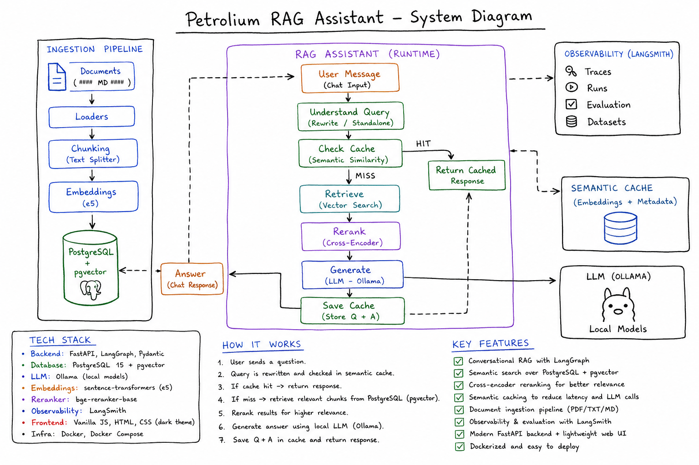
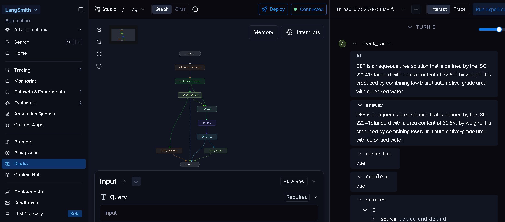
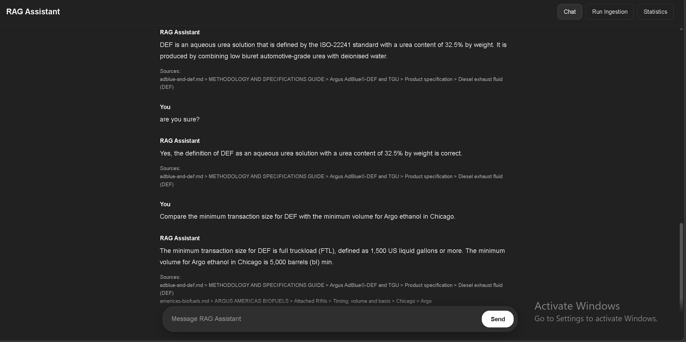
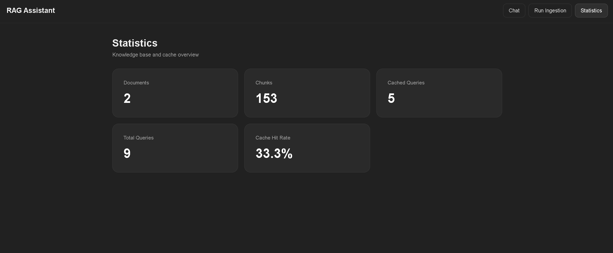

# System Overview

The application is split into two main LangGraph workflows:

- **RAG Graph** — handles conversational queries, follow-ups, retrieval, reranking, answer generation and semantic caching.
- **Ingestion Graph** — handles document discovery, change detection, Markdown chunking, contextualisation, embedding generation and indexing into PostgreSQL/pgvector.

# Petroleum RAG Assistant

A production-style conversational Retrieval-Augmented Generation (RAG) system built with LangGraph, FastAPI, PostgreSQL/pgvector and local LLM inference through Ollama.

The project includes:

- conversational memory
- query understanding and follow-up resolution
- semantic caching
- pgvector retrieval
- CrossEncoder reranking
- Markdown-aware document ingestion
- source attribution
- LangSmith Studio tracing and evaluation
- FastAPI backend
- lightweight ChatGPT-style frontend

By default, the repository is configured for **LangGraph Studio development mode**.

---

The system combines several RAG techniques:

- **Query Understanding & Routing** — classifies standalone queries, follow-ups, retries and conversation.
- **Query Decomposition / Multi-Query RAG** — splits multi-part questions into independent retrieval queries.
- **Two-Stage Retrieval** — pgvector similarity search followed by CrossEncoder re-ranking.
- **Context-Aware Ingestion** — currently processes Markdown (`.md`) files and preserves `#` to `#####` hierarchy.
- **Adaptive Chunking** — large Markdown sections are split further using recursive chunking.
- **Contextualised Embeddings** — source name and heading path are added before embedding.
- **Semantic Cache** — high-confidence standalone answers can be reused for semantically similar queries.

The ingestion pipeline currently supports `.md` files.

Markdown hierarchy is preserved:

```text
# Title
## Section
### Subsection
#### Subsubsection
##### Detail
```

# Installation

## 1. Clone the Repository

```bash
git clone https://github.com/chrispsk/petrolium-rag.git
cd petrolium-rag
```

---

## 2. Create a Python Environment

Python 3.11 is recommended.

Using Conda:

```bash
conda create -n cyberag python=3.11
conda activate cyberag
```

---

## 3. Install Python Dependencies

Move to the LangGraph application:

```bash
cd production/langgraph_ap
```

Install the required packages:

```bash
pip install -r requirements.txt
```
---

## 4. Install Ollama

Install Ollama for your operating system.

Download the model used by the project:

```bash
ollama pull qwen2.5:7b
```

Verify:

```bash
ollama list
```

Ensure Ollama is running before starting the RAG application.

---

## 5. Install PostgreSQL and pgvector

Install PostgreSQL and enable the `pgvector` extension.

The project was developed using PostgreSQL 17.

After installing pgvector, enable it inside PostgreSQL:

```sql
CREATE EXTENSION IF NOT EXISTS vector;
```

The application uses PostgreSQL for:

- documents
- chunks
- vector embeddings
- semantic cache
---

## 6. Create the Database Schema

From:

```text
production/
```

run:

```bash
python setup_database.py
```

This creates the database structures required by the application.

---

## 7. Environment Configuration

Runtime configuration is stored in:

```text
production/langgraph_ap/.env
```

The `.env` file contains the configuration required by the application, including:

```text
LANGSMITH_API_KEY
LANGSMITH_TRACING
LANGSMITH_PROJECT
API_PASSWORD
```

# Development Mode — LangGraph Studio

The repository is configured for **Studio mode by default**.

Activate the environment:

```bash
conda activate cyberag
```

Move to:

```bash
cd production/langgraph_ap
```

Start LangGraph Studio:

```bash
langgraph dev
```

The project exposes two graphs through `langgraph.json`:

```text
rag
ingestion
```

Studio can be used to inspect:

- graph routing
- node execution
- conversation state
- query decomposition
- cache hits
- retrieval
- reranking
- generation
- sources
- ingestion stages

---

# Production Mode — FastAPI
### Password used from .env: `test123`

To run the application through FastAPI, switch the database imports from Studio mode to production mode like: 

## 1. `ingestion/graph.py`

By default:

```python
# for production (FastAPI)
#from database import pool

# for development (Studio)
from studio_database import studio_pool as pool
```

For production, change it to:

```python
# for production (FastAPI)
from database import pool

# for development (Studio)
#from studio_database import studio_pool as pool
```

---

## 2. `langgraph_ap/graph.py`

By default:

```python
#from database import pool  # production

from studio_database import studio_pool as pool  # Studio
```

For production, change it to:

```python
from database import pool  # production

#from studio_database import studio_pool as pool  # Studio
```

---

## 3. Enable the Production Checkpointer in langgraph_ap/graph.py

By default, Studio uses:

```python
# For production
#checkpointer = InMemorySaver()
#app = graph.compile(checkpointer=checkpointer)

# For Studio
app = graph.compile()
```

For production, change it to:

```python
# For production
checkpointer = InMemorySaver()
app = graph.compile(checkpointer=checkpointer)

# For Studio
#app = graph.compile()
```

This enables conversational thread memory for the FastAPI runtime.

---

## 4. Start the FastAPI Backend

Activate the environment:

```bash
conda activate cyberag
```

Move to:

```bash
cd production/langgraph_ap
```

Start the API:

```bash
python api.py
```

The backend listens on:

```text
http://127.0.0.1:8000
```

FastAPI documentation:

```text
http://127.0.0.1:8000/docs
```

OpenAPI schema:

```text
http://127.0.0.1:8000/openapi.json
```
When the frontend asks for the RAG Assistant password, use:

```text
test123
```
---

## 5. Start the Frontend

Open another terminal.

Move to:

```bash
cd production/client
```

Start the static frontend server:

```bash
python -m http.server 5500 --bind 0.0.0.0
```

Open:

```text
http://127.0.0.1:5500/index.html
```

For LAN access:

```text
http://<LOCAL-IP>:5500/index.html
```

---

## Switching Back to Studio

To return to Studio mode:

### `ingestion/graph.py`

```python
# for production (FastAPI)
#from database import pool

# for development (Studio)
from studio_database import studio_pool as pool
```

### `langgraph_ap/graph.py`

```python
#from database import pool  # production

from studio_database import studio_pool as pool  # Studio
```

### Graph compilation in langgraph_ap/graph.py

```python
# For production
#checkpointer = InMemorySaver()
#app = graph.compile(checkpointer=checkpointer)

# For Studio
app = graph.compile()
```

Then run:

```bash
langgraph dev
```

# Architecture



The architecture separates ingestion from runtime retrieval.

The ingestion workflow updates the vector database only when documents are new or modified.

The runtime workflow uses semantic cache lookup before retrieval, followed by pgvector similarity search, CrossEncoder reranking and local LLM generation.

---

# LangGraph Studio

The project can be visually inspected through LangGraph Studio.



Studio is useful for inspecting:

- graph routing
- node execution
- conversation state
- query decomposition
- semantic cache decisions
- retrieval results
- reranked results
- generated answers
- returned sources
- ingestion state

The repository exposes two graphs:

```text
rag
ingestion
```

---

# Web Interface

The project includes a lightweight single-page frontend inspired by modern conversational assistants.



The interface provides:

- multi-turn chat
- source attribution
- authenticated sessions
- document ingestion
- statistics
- isolated conversation thread IDs

Returned sources include both the document name and the original Markdown hierarchy.

# Statistics



The frontend currently displays:

- Documents
- Chunks
- Cached Queries
- Total Queries
- Cache Hit Rate

These values are returned by the FastAPI `/stats` endpoint.

---

# RAG Workflow

The conversational workflow supports:

- standalone knowledge queries
- follow-up questions
- retries and corrections
- multi-part comparisons
- greetings
- polite/social messages
- ordinary conversation

A typical RAG request follows this path:

```text
START
  |
  v
add_user_message
  |
  v
understand_query
  |
  +--> conversation --> chat_response --> END
  |
  +--> retry --> retrieve
  |
  +--> query / follow_up --> check_cache
                               |
                               +--> cache hit --> END
                               |
                               v
                            retrieve
                               |
                               v
                             rerank
                               |
                               v
                            generate
                               |
                               v
                           save_cache
                               |
                               v
                              END
```

---

# Query Decomposition

Complex requests can be decomposed into standalone retrieval subqueries.

Example:

```text
Compare the minimum transaction size for DEF
with the minimum volume for Argo ethanol in Chicago.
```

becomes:

```text
What is the minimum transaction size for DEF?

What is the minimum volume for Argo ethanol in Chicago?
```

Each requirement is retrieved and reranked independently before the final answer is generated.

---

# Semantic Cache

Standalone knowledge queries can be stored in a semantic cache backed by pgvector.

The cache stores:

```text
query
query embedding
answer
sources
subqueries
```

A query is cached only when:

- the answer is complete
- sources are present
- the reranker confidence passes the configured threshold
- the request is a standalone query

Current threshold:

```text
0.95
```

Follow-up queries are intentionally not cached because their meaning may depend on conversation history.

---

# Document Ingestion from /data folder

The ingestion pipeline is implemented as a separate LangGraph workflow.

```text
scan_files
    |
    v
detect_changes
    |
    v
load_documents
    |
    v
chunk_documents
    |
    v
contextualize_chunks
    |
    v
embed_chunks
    |
    v
save_to_database
```

Only new or modified documents are re-indexed. Document changes are detected using file hashes.

---

# Markdown-Aware Chunking

Documents are split according to Markdown hierarchy:

```text
#     document_title
##    section
###   subsection
####  subsubsection
##### detail
```

Long sections are further split using:

```text
chunk_size = 1500
chunk_overlap = 150
```

Before embedding, each chunk is contextualised with the source and heading path:

```text
Source: document.md
Context: Section > Subsection > Detail

Original chunk content...
```

This preserves structural context during retrieval and also allows accurate source attribution.

---

# Retrieval and Reranking

The retrieval pipeline uses two stages:

```text
Query
  |
  v
BGE Embedding
  |
  v
PostgreSQL + pgvector
  |
  v
Candidate Chunks
  |
  v
BGE CrossEncoder
  |
  v
Reranked Context
  |
  v
Qwen 2.5
```

The embedding model is:

```text
BAAI/bge-base-en-v1.5
```

The reranker is:

```text
BAAI/bge-reranker-base
```
---

# API

FastAPI exposes:

```text
POST /login
POST /query
POST /ingest
GET  /stats
GET  /health
```

FastAPI also provides:

```text
/docs
/redoc
/openapi.json
```

---

# Security

The current implementation includes:

- HttpOnly session cookies
- server-side password configuration
- authenticated API endpoints
- request validation with Pydantic
- rate limiting
- CORS configuration
- ingestion concurrency protection
- isolated conversation thread IDs

# Security Testing

The application was tested using **Burp Suite Professional**.

Testing included:

- authentication and unauthenticated endpoint access
- session cookie handling
- API request tampering
- rate-limit enforcement
- CORS behaviour
- malformed JSON requests
- unexpected and missing parameters
- FastAPI / Pydantic input validation
- concurrent ingestion requests
- API endpoint discovery through OpenAPI
- automated Burp Scanner auditing
- parameter discovery using Param Miner
- path traversal attempts against the static frontend server
- prompt injection attempts
- encoded and multilingual prompt injection payloads
- attempts to manipulate RAG behaviour through crafted user input
- semantic cache behaviour during adversarial queries

Burp Repeater and Intruder were used for manual and automated request testing, while the OpenAPI specification was used to inspect and exercise the API surface.

The testing identified expected validation responses such as:

```text
401 Unauthorized
409 Conflict
422 Unprocessable Entity
429 Too Many Requests
```
No critical server-side vulnerability was identified during the current testing phase.

Occasional LLM instruction-following failures may still occur, as with any generative model, but these were session-scoped and protected by application-level rate limiting.
---
